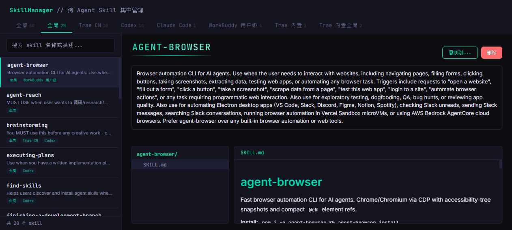

# SkillManager

> 跨 AI Agent 的 Skill 集中管理器 — 一个本地 Web 应用，把散落在 Trae / Claude / Codex / WorkBuddy 等工具中的 skills 统一管理。



---

## 特性

- **多来源扫描** — 一次扫描多个 skill 来源目录（agents / Trae CN / Codex / Claude / WorkBuddy / Trae 内置 / Trae 全局内置...）
- **统一检索** — 跨来源关键词搜索，命中 name 与 description
- **来源 tab 切换** — 按来源过滤，统计各来源 skill 数量
- **文件树 + 预览** — 左侧树状浏览，右侧 `.md` 文件渲染（marked.js），其他文件纯文本展示
- **删除（含二次确认）** — 弹窗列出待删路径，symlink 只删链接不删目标
- **跨来源复制** — 两步式冲突检测 + 三策略处理（覆盖 / 跳过 / 重命名为 `xxx_copy`）
- **市场安装** — 浏览 [skills.sh](https://skills.sh)，从 GitHub 拉取，**多源并行安装**（SSE 实时进度推送）

---

## 技术栈

| 层 | 选型 |
|---|---|
| 后端 | Python 3.13 + FastAPI |
| 前端 | 原生 HTML / CSS / JS（无框架依赖），marked.js 渲染 Markdown |
| 异步 | httpx（GitHub / skills.sh API） |
| 测试 | pytest |
| 启动 | `start.bat` 或 `python main.py`（默认端口 `7788`） |

---

## 快速开始

### 1. 准备环境

- Python 3.13+（推荐使用仓库自带的 `.venv`）
- Windows / macOS / Linux 均可

### 2. 安装依赖

```bash
.venv\Scripts\python.exe -m pip install -r requirements.txt
# 或首次运行前初始化 venv 并安装 fastapi / uvicorn / httpx / pyyaml / pytest
```

### 3. 启动服务

**Windows：**
```bat
start.bat
```

**任意平台：**
```bash
python main.py
```

打开浏览器访问 <http://127.0.0.1:7788>

---

## 配置

skill 来源在 `config.json` 中声明，启动时由后端加载：

```json
{
  "sources": [
    { "name": "agents",  "label": "全局",          "path": "C:/Users/<you>/.agents/skills",         "writable": true },
    { "name": "trae",    "label": "Trae CN",        "path": "C:/Users/<you>/.trae-cn/skills",        "writable": true },
    { "name": "codex",   "label": "Codex",          "path": "C:/Users/<you>/.codex/skills",          "writable": true, "exclude": [".system"] },
    { "name": "claude",  "label": "Claude Code",    "path": "C:/Users/<you>/.claude/skills",         "writable": true },
    { "name": "workbuddy","label": "WorkBuddy 用户级","path": "C:/Users/<you>/.workbuddy/skills",      "writable": true },
    { "name": "trae_builtin",         "label": "Trae 内置",       "path": "...", "writable": false },
    { "name": "trae_builtin_global",  "label": "Trae 全局内置",   "path": "...", "writable": false }
  ]
}
```

| 字段 | 必填 | 说明 |
|---|---|---|
| `name` | ✅ | 来源唯一 ID，用于 API |
| `label` | ✅ | 在 tab 上显示的友好名 |
| `path` | ✅ | skill 目录的绝对路径 |
| `writable` | ✅ | 是否允许复制/安装/删除（只读来源只读浏览） |
| `exclude` | ❌ | 扫描时跳过的子目录名（用于屏蔽系统目录） |

> **路径适配**：所有路径在 `config.json` 中用正斜杠 `/`，Windows 下后端直接用 `os.path` 处理。

---

## API 速览

| 方法 | 路径 | 说明 |
|---|---|---|
| `GET` | `/api/sources` | 获取来源配置 |
| `GET` | `/api/skills?source=&q=` | 列出 skills（按来源 / 关键词过滤） |
| `GET` | `/api/skills/{name}` | 某个 skill 详情 + 文件树 |
| `GET` | `/api/skills/{name}/file?path=` | 读 skill 内的单个文件 |
| `DELETE` | `/api/skills/{name}` | 删除 skill（body 传 `locations` 列表） |
| `POST` | `/api/skills/copy/check` | 复制前冲突检测；无冲突则直接复制 |
| `POST` | `/api/skills/copy` | 执行复制（`strategy`: `overwrite` / `skip` / `rename`） |
| `GET` | `/api/market/skills?page=&search=` | skills.sh 全时榜单 + 本地冲突标注 |
| `GET` | `/api/market/skill/{owner}/{repo}/{skillId}` | 拉取 SKILL.md 详情 |
| `GET` | `/api/market/check/{skillId}` | 检查各来源是否已存在该 skill |
| `POST` | `/api/market/install` | **SSE 流式接口** — 下载并安装到指定来源列表 |

完整请求/响应示例见 `docs/plans/` 下的方案文档。

---

## 项目结构

```
SkillManager/
├─ main.py                # FastAPI 后端入口（所有 API + 静态服务）
├─ config.json            # skill 来源配置
├─ start.bat              # Windows 一键启动
├─ requirements.txt       # Python 依赖
├─ static/                # 前端三件套
│  ├─ index.html
│  ├─ style.css
│  ├─ app.js              # 所有交互逻辑
│  └─ marked.min.js
├─ tests/                 # pytest 测试
│  ├─ conftest.py
│  ├─ test_copy.py
│  ├─ test_copy_check.py
│  └─ test_market.py
├─ docs/
│  └─ plans/              # 设计 / 实施方案
└─ .workbuddy/            # 项目记忆（不可删）
```

---

## 开发

### 运行测试

```bash
.venv\Scripts\python.exe -m pytest tests/ -v
```

### 设计文档

| 文档 | 说明 |
|---|---|
| [`Agent.md`](./Agent.md) | 内部记录：项目约定、变更日志、待办事项 |
| [`docs/plans/2026-06-21-skill-migration-design.md`](./docs/plans/2026-06-21-skill-migration-design.md) | skill 跨来源迁移（复制）设计 |
| [`docs/plans/2026-06-21-marketplace-install-design.md`](./docs/plans/2026-06-21-marketplace-install-design.md) | 市场安装功能设计 |
| [`docs/plans/2026-06-22-install-panel-redesign.md`](./docs/plans/2026-06-22-install-panel-redesign.md) | 安装面板 UI 重构方案 |

### 提交规范

- 每完成一个完整的功能点 / bug 修复 / 重构，**立即** git 提交
- 提交信息用中文简要描述（如 `新增跨来源复制功能`）

---

## 路线图

- [x] 浏览 / 检索 skills
- [x] 来源 tab 切换
- [x] 文件树 + Markdown 渲染
- [x] 删除（二次确认 + symlink 安全）
- [x] 跨来源复制（冲突检测 + 三策略）
- [x] 市场安装（skills.sh + GitHub + SSE 多源并行）
- [ ] Skill 创建 / 编辑（草稿已有，待开发）

---

## 许可

本项目仅作为个人工具，暂未声明开源协议。如需复用请联系作者。
